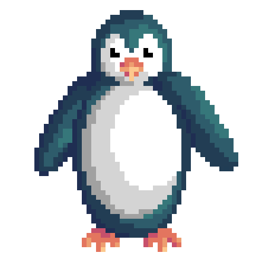

    

        <h2 style="color: #ed9e70">How to play</h2>
        
The goal is to get to the end of the maze before the time runs out. 
        The exit is located at the bottom right of the maze. The Exit is locked until you collect all three golden fish that are spread the map.

        <h2 style="color: #ed9e70"> How to start game </h2>
        

            The game can be started with Gradle.
        

        <h2 style="color: #ed9e70">Controls</h2>
        

            <li>WASD or arrow keys : move penguin towards desired direction </li>
            <li>Press ESC key to pause the game</li>
        

    

    <h2 align="center">HAVE FUN</h2>
    

